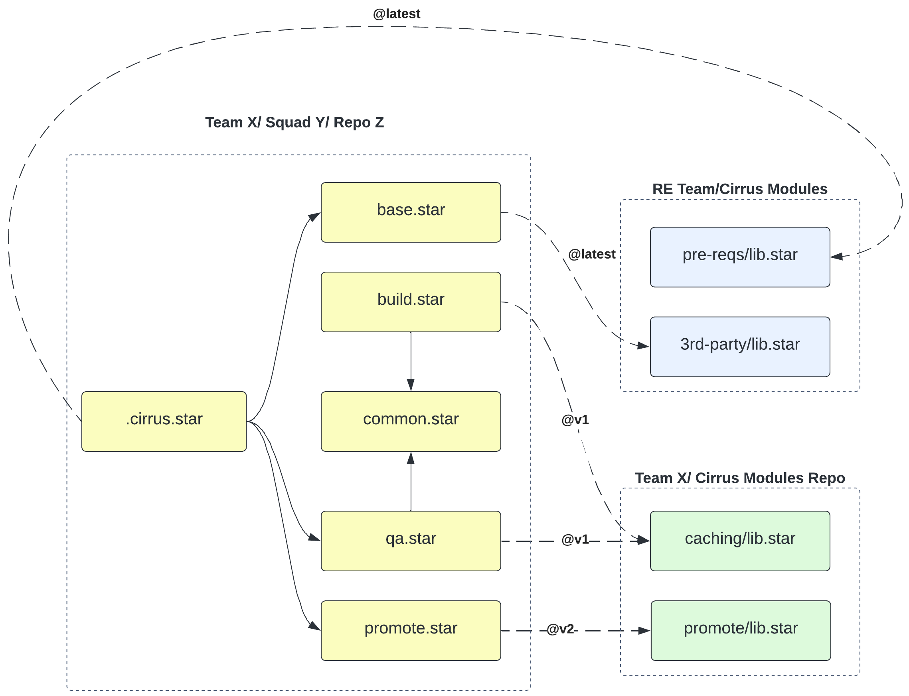

### Starlark Guide

This document describes the coding style for Starlark code in the Bazel project.

NOTE:

- as we are pioneering the use of Starlark in the SonarSource organization we are for now keeping it in Sonar IaC repo
- this document should be in the extranet or in a RE team repo some day but having it in the Sonar IaC repo is a good
  start and is easier for reviews
- it should be a living document, updated as we learn more about Starlark

## Table of Contents

- [General](#general)
    - [Starlark capabilities](#starlark-capabilities)
    - [Module loading](#module-loading)
    - [Builtins](#builtins)
    - [Starlark is no Python](#starlark-is-no-python)
- [Design patterns](#design-patterns)
    - [Introduction](#introduction)
    - [Declarative vs Imperative balance](#declarative-vs-imperative-balance)
    - [Builders](#builders)
    - [Recursive aggregation of configuration](#recursive-aggregation-of-configuration)
- [Comments](#comments)
- [Formatting](#formatting)
- [Namings](#namings)
    - [Env variables](#env-variables)
    - [Factories](#factories)
    - [Scripts](#scripts)
    - [Task definitions](#task-definitions)
- [Modules](#modules)
    - [By domain partitioning](#by-domain-partitioning)
    - [By pipeline activity partitioning](#by-pipeline-activity-partitioning)
    - [Hybrid partitioning](#hybrid-partitioning)
- [Sharing topologies](#sharing-topologies)
    - [Governance](#governance)
    - [Versioning](#versioning)
    - [Sharing architecture overview](#sharing-architecture-overview)
- [Development tools](#tools)

## General

### Starlark capabilities

Starlark is a procedural programming language akin to Python, originating from the Bazel build tool. It's ideal for
embedding within systems that need to safely execute user-defined logic.

Cirrus CI opted for Starlark over common alternatives like JavaScript/TypeScript or WebAssembly due to several key
factors:

No compilation required: Starlark scripts can be executed immediately without a full-fledged compilation and deployment
process for a few lines of code.

Platform independence: Starlark scripts can run instantly on any platform thanks to a Starlark interpreter written in
Go, seamlessly integrating with the Cirrus CLI and Cirrus CI infrastructure.

Built-in module loading: Starlark's built-in module loading functionality is ideal for sharing configurations. See
module loading for more details.

Starlark in the context of Cirrus CI is another pathway to generate YAML pipeline specification for the Cirrus CI
engine. When a Starlark specification is executed it is transformed into a standard YAML file to be processed by Cirrus.

The Starlark documentation highlights the fact that Starlark is superior to YAML in any way, it does not seem we would
lose anything with Starlark.

### Module loading

Starlark provides a built-in load function enabling us to reuse existing building blocks.

There are 2 modes and 1 supported format:
Local from the file system: the module lives as a .star file in the same repository
Remote from Git: a Git URL is provided with the name of the Starlark file and the branch or tag or commit id

Local example:

```Python
load(".ci/notify-slack.star", "notify_slack")
```

Remote example (where v2 is a branch name of the repo cirrus-modules):

```Python
load("github.com/SonarSource/cirrus-modules@v2", "load_features")
```

There is another way to load a building block locally: by using another built-in function fs.read we can also load YAML
files and then they can be converted to dictionaries to be used by Starlark. This can be useful when we want to reuse
the existing YAML definitions of a given legacy pipeline without rewriting them in Starlark.

Strictly speaking, a module is written in Starlark.

### Builtins

Starlark, in Cirrus, comes with builtins provided by Cirrus and by the language itself.

The most prevalent seem to be:

- `load`
- `fs`
- `env`
- `yaml`

### Starlark is no Python

Please have a look at [Bazel's specific page](https://bazel.build/rules/language#differences_with_python) differences
with Python to understand what you can expect from Starlark.

## Comments

Python docstrings are supported in Starlark.

Use them to document the purpose of a function, its parameters, and its return value; specifically, the for the common
building blocks.

## Formatting

Python formatting is supported in Starlark.

## Design patterns

### Introduction

A Cirrus task is generally composed of few sections:

- dependencies: the tasks that need to be executed before this task
- context the task should take into account: this context is specified with environment variables
- platform on which the task runs: specifies the OS, the CPU architecture, and the runtime (Container or VM)
- pre-exec: what to do before the task is executed (caching configuration, folder creation, download of artefacts, …)
- the execution: many scripts can be involved, this where the real purpose of the task is implemented
- post-exec actions: what to do after the task has been executed (log attachments, notifications, …)

Many of those sections are reusable and can be shared across tasks, and sometimes across repositories.

IMPORTANT NOTE: it's critical to understand that key order matters a lot for Cirrus.

### Declarative vs Imperative balance

Starlark enables a declarative approach or an imperative approach to define a task.

The declarative approach is more concise and easier to read, while the imperative approach is more flexible and can be
more powerful.

We recommend using an hybrid approach where:

- the declarative approach is used to define the structure of the task
- the imperative part is used to specify the configuration of the various sections of the task

Example:

```Python
def build_task():
    return {
        "build_task": {
            "env": build_env(),
            "eks_container": custom_image_container_builder(cpu=10, memory="6G"),
            "project_version_cache": project_version_cache(),
            "gradle_cache": gradle_cache(),
            "build_script": build_script(),
            "cleanup_gradle_script": cleanup_gradle_script(),
            "on_success": profile_report_artifacts(),
            "store_project_version_script": store_project_version_script()
        }
    }
```

Additionally, the implementation of the purpose of the task can be split into many scripts, each script being
responsible for a specific concern.

### Builders

Builders can support different configuration options and can be used to create complex configurations.

Simple example with default values and complete documentation:

```Python
def ec2_instance_builder(
        image=RE_WINDOWS_JDK7_IMAGE,
        platform=RE_WINDOWS_PLATFORM,
        instance_type=RE_LARGE_INSTANCE_TYPE,
        preemptible=False,
        use_ssd=True
):
    """
    Base configuration for a VM that uses a pre-defined image provided by RE Team.

    Provides the default values for the VM configuration:
    - image: the image to use for the VM by default RE_JAVA_17_IMAGE
    - platform: the platform of the VM, by default "windows"
    - instance_type: the type of the VM, by default RE_LARGE_INSTANCE_TYPE
    - preemptible: whether the VM is preemptible, by default False
    - use_ssd: whether the VM uses SSD, by default True

    :return: a dictionary with the configuration for the VM
    """
    return {
        "experimental": "true",
        "image": image,
        "platform": platform,
        "region": RE_DEFAULT_REGION,
        "type": instance_type,
        "subnet_id": "${CIRRUS_AWS_SUBNET}",
        "preemptible": preemptible,
        "use_ssd": use_ssd,
    }
```

Advanced example without control flow and with a lot of configuration options:

```Python
def build_task_builder(task_id, name, alias, depends_on, **kwargs):
    task_conf = {
        "name": name,
        "alias": alias,
        "eks_container": default_container_builder(True),
        "depends_on": depends_on,
        "set_docker_host_script": set_docker_host_script(),
    }
    task_conf |= gradle_cache()
    task_conf |= kwargs
    return {task_id: task_conf}
```

### Recursive aggregation of configuration

Cirrus looks at the file .cirrus.star in order to generate the pipeline. It’s very easy to turn this file into a mess by
importing dozens of modules and calling tons of functions from it.

In general when a script or a class suffers from too many responsibilities it’s a good idea to split it into smaller
chunks.

One way to get a cleaner code is to consider the Starlark code base as a tree of modules. Each module is a node that
provides one unique consolidated configuration to its ancestor. Each module implements a `<module domain>_all_tasks`
function returning all the configurations for the domain. Then `.cirrus.star` does not have to know about how this is
implemented and is not exposed to the changes in the implementation.

This is also closely related to the “Separation of concern” principle.

This pattern can also be applied to a shared module.

`.cirrus.star` content:

```Python
load("github.com/SonarSource/cirrus-modules@v2", "load_features")
load(".cirrus/modules/base.star", "base_all_tasks")
load(".cirrus/modules/build.star", "build_all_tasks")
load(".cirrus/modules/deploy.star", "deploy_all_tasks")
load(".cirrus/modules/qa.star", "qa_all_tasks")
load(".cirrus/modules/housekeeping.star", "housekeeping_all_tasks")


def main(ctx):
    conf = dict()
    re_builtins = load_features(ctx)
    merge_dict(conf, re_builtins)
    merge_dict(conf, base_all_tasks())
    merge_dict(conf, build_all_tasks())
    merge_dict(conf, deploy_all_tasks())
    merge_dict(conf, qa_all_tasks())
    merge_dict(conf, housekeeping_all_tasks())
    return conf
```

`base.star` content:

```Python
load(
    "common.star",
    "default_container_builder",
    "set_docker_host_script",
    "gradle_cache"
)


def pre_reqs_task():
    return {
        "Prerequisites_task": {
            "name": "Prerequisites",
            "alias": "prereqs",
            "check_script": ".cirrus/scripts/check-env.sh",
            "eks_container": default_container_builder()
        }
    }


def code_analysis_task():
    task_conf = {
        "name": "Analyze Code",
        "eks_container": default_container_builder(True),
        "depends_on": "prereqs",
        "set_docker_host_script": set_docker_host_script(),
    }
    task_conf.update(gradle_cache())
    task_conf.update({"analyze_script": ".cirrus/scripts/scan.sh"})
    return {"AnalyzeCode_task": task_conf}


def base_all_tasks():
    conf = {}
    merge_dict(spec, pre_reqs_task())
    merge_dict(spec, code_analysis_task())
    return conf
```

## Namings

### Env variables

We recommend to name functions defining env variables with the suffix `_env` to make it clear they are providing env
variables.

Example:

```Python
def whitesource_api_env():
    return {
        "WS_API_KEY": "VAULT[development/kv/data/mend data.apikey]"
    }
```

### Builders

We recommend to name functions defining builders with the suffix `_builder` to make it clear they are providing advanced
configuration options.

Example:

```Python
def ec2_instance_builder(
        image,
        platform,
        instance_type,
        preemptible,
        use_ssd
):
    return {
        "experimental": "true",
        "image": image,
        "platform": platform,
        "region": "eu-central-1",
        "type": instance_type,
        "subnet_id": "${CIRRUS_AWS_SUBNET}",
        "preemptible": preemptible,
        "use_ssd": use_ssd,
    }
```

### Scripts

We recommend to name functions defining scripts with the suffix `_script` to make it clear they are scripts.

Example:

```Python
def promote_script():
    return [
        "source cirrus-env PROMOTE",
        "cirrus_jfrog_promote multi",
        "source ${PROJECT_VERSION_CACHE_DIR}/evaluated_project_version.txt",
        "github-notify-promotion",
        "burgr-notify-promotion"
    ]
```

### Task definitions

We recommend to name functions defining tasks with the suffix `_task` to make it clear they are scripts.

Example:

```Python
def sca_scan_task():
    return {
        "sca_scan_task": {
            "only_if": is_main_branch(),
            "depends_on": "build",
            "env": whitesource_api_env(),
            "eks_container": custom_image_container_builder(),
            "gradle_cache": gradle_cache(),
            "project_version_cache": project_version_cache(),
            "whitesource_script": whitesource_script(),
            "cleanup_gradle_script": cleanup_gradle_script(),
            "allow_failures": "true",
            "always": {
                "ws_artifacts": {
                    "path": "whitesource/**/*"
                }
            },
            "on_success": profile_report_artifacts(),
        }
    }
```

### Conditions

We recommend to name functions defining conditions with the prefix `is_` to make it clear they are conditions.

Example:

```Python
def is_main_branch():
    return "$CIRRUS_USER_COLLABORATOR == 'true' && $CIRRUS_TAG == \"\" && ($CIRRUS_BRANCH == $CIRRUS_DEFAULT_BRANCH || $CIRRUS_BRANCH =~ \"branch-.*\")"

```

## Modules

Starlark enables developers to structure their pipeline code in a lot of different ways like with any language
supporting modules and functions. It’s hard to come up with a one-size-fits-all approach but we can try to document some
approaches we feel would make sense.

Good modularity is about finding a way to split things into manageable pieces that make sense from many perspectives in
a given context: domain-based, readability, maintenance, migration, and smaller blast radiuses, …

Here are the typical ways you can combine to create modules.

### By domain partitioning

A domain is a set of similar concerns grouped together: it can be related to a product feature (billing for SonarCloud)
or it can also be technical (caching, Maven, …).

For example, if a repository contains the following folders, infrastructure, platform, and application, three Starlark
local modules responsible for managing infrastructure, platform, and application pipeline steps could be created:

- `infrastructure.star`
- `platform.star`
- `application.star`

Then each module takes care of the lifecycle of each domain from a CI/CD perspective.

### By pipeline activity partitioning

Modules are created to manage typical pipeline activities.

For instance, if a product source code goes through build, tests, QA, and deployment/promotion, the following local
modules are created:

- `build.star`
- `tests.star`
- `qa.star`
- `promote.star`

### Hybrid partitioning

Depending on the scope of the pipeline it can be beneficial to use many partitioning techniques, like to have a module
mapped to a domain loading other modules mapped after pipeline activities.

## Sharing

### Sharing topologies

Many sharing topologies can co-exist depending on the context and the needs.

For instance, one squad might share building blocks between its repositories and use building blocks provided by RE.

Typical topologies in theory:

| Name      | Description                                                   | Support   |
|-----------|---------------------------------------------------------------|-----------|
| Local     | Inside a repo, building blocks are reused across a pipeline   | Supported |
| Squad     | A squad reuses building blocks across many squad repositories | Not yet   |
| Team      | A team reuses building blocks across many team repositories   | Not yet   |
| Community | N teams reuse building blocks across many repositories        | Not yet   |
| Company   | Every team is using a set of building blocks                  | Supported |

Use cases in practice (not an extensive list of use cases):

|           |                                                                                                                           |
|-----------|---------------------------------------------------------------------------------------------------------------------------|
| Local     | A pipeline specification snippet is reused in many activities of the pipeline: configuration for containers, logging conf |
| Squad     | A Squad uses the same building blocks across most repositories: common tasks                                              |
| Team      | A team uses the same building blocks across most repositories: shared repos, squads having common interests,              |
| Community | Many teams have the same need for some activities: orchestrator blocks, ...                                               |
| Company   | Most teams use some building blocks: common env vars, promote task                                                        |

### Governance

Sharing code has technical and social implications.

It's indeed very easy to share code through technical means, but it's far harder to get people organized around it in
order to preserve the benefits in time.

That's why governance of shared code must be carefully considered as it is common for governance to be neglected,
leading to local optimizations that ignore the broader impact.

Effective governance requires answering questions about:

- ownership
- change management
- stakeholder needs

For large organizations, governance is often managed by a dedicated team but it requires dedicated resources and a
product mindset.

Risks can be mitigated by starting with a lower-scope topology and gradually consolidating to a broader scope as needed.

Intentional duplication can be used to mitigate governance risks when proper governance is not yet possible.

We should not forget sharing is a tool for higher-end goals like fast and smooth product development.

Sharing can’t be a goal in itself without a proper understanding of the pros and cons.

For instance, it’s likely more beneficial to have two teams being plainly in control of similar building blocks instead
of creating a single point of sharing with weak governance that creates delivery frictions, unexpected impacts, and
turns the initial good intent into a negative multiplier effect.

### Versioning

In this section, we consider remote modules only. As seen previously a remote module lives in a Git(Hub) repository.

A good versioning policy depends on mostly:

- The lifecycle of the module: the pace of changes, …
- The criticality of the module: should it be always up to date on the user side?
- The needs of users: stability vs innovation
- The intent of the provider: optimizing for stability, consistency, security, and version support effort, …

Starlark relies on branch names, tag names, or commits IDs to specify the version of a given Starlark resource:

- Branch-based: `load("github.com/cirrus-modules/lib.star@master", "task")`
- Convenient branch-based: `load("github.com/cirrus-modules/lib.star@v1", "task")`
- Commit-based: `load("github.com/cirrus-modules/lib.star@15f672842..3d888", "task")`
- Tag-based:  `load("github.com/cirrus-modules/lib.star@1.0.1", "task")`

| Versionning example   | Description                                                                                                |
|-----------------------|------------------------------------------------------------------------------------------------------------|
| `@<major version>`    | The RE team is already using this approach. Example: https://github.com/SonarSource/cirrus-modules/tree/v2 |
| `@latest`             | Users always get the latest changes. There is only one version.                                            |
| `@stable` and `@next` | A middle ground between having many major versions and only the latest.                                    |

### Sharing architecture overview

This diagram represents some of the sharing topologies in action. It’s there to help module builders to reflect on the
lifecycle of their modules. An arrow means a Starlark module depends on another one, a plain line means local, and a
dashed line means remote.

The prereqs library contains mandatory configuration elements used for instance to connect Cirrus tasks to its AWS
execution runtime: it seems there is only one Cirrus cluster in Prod. To use major versions instead of @latest would
imply developers have to migrate their pipeline to refer to the next version of the prerequisites to make their pipeline
work again with the new changes applied to the Cirrus cluster. The same for 3rd party configurations: there is only one
Repox, one Burgr, and one GitHub service that developers can use, they need to get the latest configuration available
for each every time they execute their pipelines.



## Development tools

Jetbrains IDEs have a [Starlark plugin](https://plugins.jetbrains.com/plugin/16744-cirrus-starlark-support) developer by Cirrus that can be installed to get syntax highlighting and code completion.
